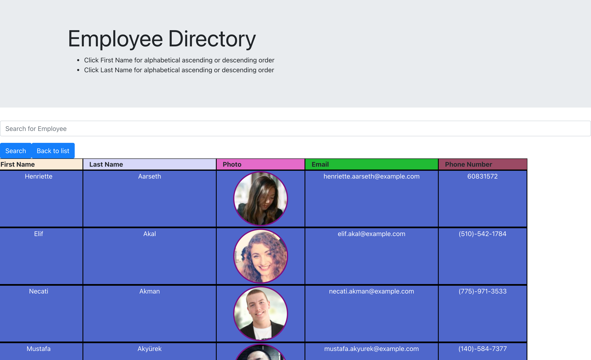

# Unit 19 React Homework: Employee Director

by: Jack Funck
## table of Contents:
 - [Link.](#link)
 - [ Description. ](#desc)
 - [ Instructions. ](#instr)
 - [Technologies.](#tc)
 - [ Video. ](#video)
 - [Screen-Shots.](#sc)

<a name="link"></a>
## Link
give it a try: <a href="https://polar-lowlands-57059.herokuapp.com/" target="_blank"> Employee Directory</a>

<a name="desc"></a>
## Description
This app utilizes an API to populate random users and then create a directory. Other users on the app can search for employees by "name" and also organize each field ( First Name, Last Name) in ascending or descending order.


<a name="instr"></a>
## Instructions
Either "Click" Link([Link.](#link)) above or

Run this command in your Command line
```
npm start
```

<a name="tc"></a>
## Technologies Used
* Node.js
* JavaScript
* bootstrap
* React
* Random User Api


<a name="video"></a>
# Video of how it works.
> If you click GIF you will be navigated to YouTube for a full-video.

[](https://youtu.be/QOqVFPdNAf4)


<a name="sc"></a>
# Screen Shots
### Home



